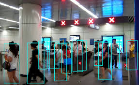

# 
 Object Detection Using YOLO v3

  

### YOLO, A State-Of-The-Art and A Real Time Object Detection System, Created by Joseph Redmon 

and its based on the Darknet Neural Network.

It was developed in 2015 and Performed very well other than any object detection algorithms at that 

time. The name itself says, That it just goes through the image just once. YOLO contains its own neural 

network architecture based on CNN. Now Its became the first priority for Object Detection Problems. 

And we can detect objects in live with the help of YOLO. 

Difference Between Five Versions Of YOLO:
 * YOLOv2 is better than YOLOv1 in terms of Accuracy and Speed.

 * YOLOv3 is Accurate than YOLOv2 but not faster. 

* YOLOv4 is Accurate than YOLOv3.

* YOLOv5 is faster and takes less storage space than other versions.

Now, lets start with the version with highest Accuracy is Yolov3 . The original reference of YOLOv3 

will be found here. With the help of Darknet we can implement Object Detection Model in Google 

colab. (https://colab.research.google.com/drive/1lTGZsfMaGUpBG4inDIQwIJVW476ibXk_)

How To Train YOLOv3 Object Detection Model : 

In Colab Tutorial we can get instructions like how to create some essential files to train the Object 

Detection model. Before that we need images to train with Annotations. We have several tools to do 

annotations which gives the txt file with Obj - Class, X - Center, Y - Center, Height and Width. 

After cloning darknet folder in google colab as per instructions from tutorial, We should edit few 

files and need to add some folders.

Darknet53.conv.74  is a pre-trained weights, We should use this file while training. 

Configuration File, We should select the configuration file as per our dataset size. If we have small 

dataset we can use yolov3-tiny.cfg and it will work faster. Otherwise we can use normal yolov3.cfg. 

And we need to edit batch to 64 , subdivision to 2 , filters and number of classes in network layers. 

We should change the number of filters in convolution layer just before every YOLO output ["yolo"].

And Filters we can calculated as 

 Anchors * (5 + no.of classes)
 Anchors * (5 + no.of classes) 
For Example, if we choose 3 anchor boxes and having 4 object classes to detect, we should edit the 

filters as 27. Next, we should change the number of object classes to detect as per our model.

Image Folder should contain all images with annotation text files as shown in the above image .

train.txt and test.txt should contain the links of images as shown below.

obj.data should contains the links to train file, test file, and backup folder and no.of classes. After 

training, the .weights file will be downloaded into backup folder for every 100 iterations till 900 

and then every 10000

obj.names file should contain the names that you used while annotation. 

After uploading all the files we can train our model as per the instructions given in the Google colab 

tutorial, and we can check the mAP also. You can stop the training process once the average loss is 

< 0.06 or else once the average loss is no longer increases.

## Advantages :

This is a faster Object Detection model with 45 frames per sec.

## Disadvantages :

It is difficult to locate the smaller objects in an image. This is due to the spatial constrain of the algorithm.

